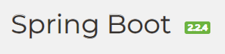
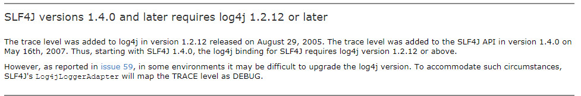

# SpringBoot



> Short blurb about what your product does.

[![NPM Version][npm-image]][npm-url]
[![Build Status][travis-image]][travis-url]
[![Downloads Stats][npm-downloads]][npm-url]
[](https://github.com/RichardLitt/standard-readme)

本仓库包含以下内容：

1. SpringBoot各种Demo集合项目[demo](https://github.com/michrow/spring-boot/tree/master/demo)
2. SpringBoot各个知识点运用汇总项目[myapp](https://github.com/michrow/spring-boot/tree/master/myapp)
3. SpringBoot cache项目[cachedemo](https://github.com/michrow/spring-boot/tree/master/cachedemo)
## 内容列表

- [背景](#背景)
- [安装](#安装)
- [使用](#使用)
- [项目更新记录](#文档)
- [相关仓库](#相关仓库)
- [维护者](#维护者)
- [如何贡献](#如何贡献)
- [使用许可](#使用许可)

## 背景

在SpringBoot学习过程会写大量的示例demo，本仓库主要记录各个demo代码。

这个仓库的目标是：


1. 记录SpringBoot学习历程
2. 记录各个demo
3. 学习结果检查，及做一个完成项目汇总
4. 学习应用github


## 安装

这个项目使用 [node](http://nodejs.org) 和 [npm](https://npmjs.com). 请确保你本地安装了它们。
```sh
$ npm install --global standard-readme-spec
```

## 使用
### case:
[custom-initializr](case/custom-initializr)

springboot initializr是新建SpringBoot项目的一个工具应用，用户可以根据需要定制此工具，
custom-initializr就是一个定制之后的一个应用。

使用方式：
可以直接启动项目，在开发工具中地址选择：<http://localhost:8080>即可。

## 文档

文档是对项目开发过程中遇到的一些问题的详细记录，主要是为了帮助没有基础的小伙伴快速理解这个项目。

1. [权限数据库设计](https://github.com/lenve/vhr/wiki/1.%E6%9D%83%E9%99%90%E6%95%B0%E6%8D%AE%E5%BA%93%E8%AE%BE%E8%AE%A1)
2. [服务端环境搭建](https://github.com/lenve/vhr/wiki/2.%E6%9C%8D%E5%8A%A1%E7%AB%AF%E7%8E%AF%E5%A2%83%E6%90%AD%E5%BB%BA)

### 更新记录

### 2020.3.11

1、使用低版本的log4j替换现有logback
package:case/log

	<dependency>
	    <groupId>org.springframework.boot</groupId>
	    <artifactId>spring-boot-starter-web</artifactId>
	    <exclusions> <!--排除springboot默认logback-->
		    <exclusion>
			    <artifactId>spring-boot-starter-logging</artifactId>
			    <groupId>org.springframework.boot</groupId>
		    </exclusion>
	    </exclusions>
    </dependency>
    
    <dependency>
	    <groupId>org.springframework.boot</groupId>
	    <artifactId>spring-boot-starter-log4j</artifactId>
	    <version>1.3.8.RELEASE</version>
	    <exclusions> <!--替换现有log4j-->
		    <exclusion>
			    <artifactId>log4j</artifactId>
			    <groupId>log4j</groupId>
		    </exclusion>
	    </exclusions>
    </dependency>
    
    <!--引入当前使用log4j版本-->
    <dependency>
	    <groupId>log4j</groupId>
	    <artifactId>log4j</artifactId>
	    <version>1.2.8</version>
    </dependency>

starter-log4j-1.0版本中默认log4j为1.2.17版本，替换为1.2.8之后，会有一个提示：
*
> SLF4J: This version of SLF4J requires log4j version 1.2.12 or later. See also http://www.slf4j.org/codes.html#log4j_version

原因：



### 2020.3.10
1、利用Spring AOP通过注解动态切换数据源

包：com.example.multiswitch.dbaop

2、测试多数据源切换事物
  
test: com.example.multiswitch.service.MultitestServiceTest.addMultiTest3()

3、增验证jar 在Springboot中的运行情况
antisamy-1.5.7.jar
batik-css-1.9.1.jar
batik-util-1.6.1.jar
commons-beanutils-1.6.1.jar
commons-lang-2.1.jar
xstream-1.2.2.jar
以上jar验证可以查看： case/tools

freemarker-2.3.20.jar
以上jar验证可以查看：demo
验证方式：修改默认依赖版本为2.3.20


### 2020.3.9
1、druid和spring 通过AOP关联
2、wallfilter、logfilter、
3、连接池泄漏检查
4、配置JNDI
5、数据库加密
6、多数源动态切换和添加

### 2020.3.4

1、springboot增加druid数据连接池
a、多数据源配置
b、springtoot自动配置
c、JavaConfig手动配置
d、开启监控stat


### 2020.3.3
1、SpringBoot中增加excel和pdf操作

2、测试Servet4在Springboot中的应用

几个前提条件：

* 安全传输层协议（TLS）
* Servlet 4.0 is part of Java EE 8, and hence, it would require Java 9+ along with Spring 5.x.
* Tomcat 9 supports HTTP/2

- 配置https:

	1. 使用JDK工具生成证书库：keytool -genkey -alias tomcat -storetype PKCS12 -keyalg RSA -keysize 2048 -storepass tomcat -keystore keystore.p12 -validity 3650
	2. SpringBoot配置：
	
	
>     # https支持
>     server.ssl.key-store=keystore.p12
>     server.ssl.key-store-password=tomcat
>     server.ssl.keyStoreType=PKCS12
>     server.ssl.key-alias=tomcat
>     # http/2
>     server.http2.enabled=true


### 2020.2.25
SpringBoot 缓存内容：

1、SpringBoot自身定义了一套缓存接口，简化了JCache缓存接口，仅仅保留了CacheManager和Cache。
2、SpringBoot中各个缓存注解使用
3、继承Redis缓存

### 2020.2.20

添加错误数据定制

### 2020.2.20

Restful风格请求，完成员工的CURD


### 2020.2.19

1、引入thymeleaf

首先取出原来演示mybatis分页插件引入的freemarker
修改：

	a、pom.xml:
	 去处：spring-boot-starter-freemarker引入
	
	b、db配置文件，去除freemarker配置

2、完成国际化

  国际化语言切换两种实现方式：

  - LocaleChangeInterceptor
  - LocaleResolver

3、完成用户登录及拦截器，解决其中两个问题：

  - 登录Post重复提交，通过重定向解决
  - 用户登录拦截器，（SpringBoot2.x）静态资源也会拦截，需要排除
> 登录有使用到jQuery背景插件backstretch，使用时有在js中引入图片，图片路径使用相
> 对路径，为了方便修改servlet上下文，此处略作调整，通过document.location截取到上下文路径

### 2020.2.17

本阶段完成如下事：
1、补充Mybais 分页插件示例操作：

- 分页插件pageHelper
	* 引入依赖
	* 代码示例
	* 样例
	* 注意事项


### 2020.2.15

本阶段主要添加了db使用mybatis操作数据的操作。主要功能如下：
[具体可参看笔记](https://app.yinxiang.com/shard/s43/nl/23892682/f66de40b-3b40-4809-bf99-dc526230ec0e)

- Mapper.xml
	- CRUD标签
		- select insert update delete
	- \#{}和${}
		- 参数定位 
		- 模糊查询
	- ResultMap
		- POJO属性名与数据库列明不一致
		- 高级查询
			- 一对一 一对多 多对多 延迟加载
	- SQL片段 
	- 动态SQL
		if choose、when、otherwise where set foreach
	- SQL中特殊符号处理
		- 使用转义符
- 缓存
	- 一级缓存 
	- 二级缓存 
	- 总结（生产环境不建议使用）
- 问题及解决方式
	- 数据库列与POJO不一致 
	- mybatis 在多数据源情况下配置不生效 
	- POJO包扫描别称 
	- 获取自增主键 
	- MyBatis开启日志 
	- Mybatis 一对多查询时，数据覆盖


### 2020.2.13 更新

本次更新主要完善README.md，按照标准README.md建议修改文档


#### 相关文档：

1. [部门数据库设计与存储过程编写](https://github.com/lenve/vhr/wiki/12.%E9%83%A8%E9%97%A8%E6%95%B0%E6%8D%AE%E5%BA%93%E8%AE%BE%E8%AE%A1%E4%B8%8E%E5%AD%98%E5%82%A8%E8%BF%87%E7%A8%8B%E7%BC%96%E5%86%99)

## 相关仓库

- [Art of Readme](https://github.com/noffle/art-of-readme) - 💌 写高质量 README 的艺术。
- [open-source-template](https://github.com/davidbgk/open-source-template/) - 一个鼓励参与开源的 README 模板。

## 维护者

[@michrow](https://github.com/michrow).

## 如何贡献

非常欢迎你的加入! [提一个Issue](https://github.com/RichardLitt/standard-readme/issues/new) 或者提交一个 Pull R equest.


标准 Readme 遵循 [Contributor Covenant](http://contributor-covenant.org/version/1/3/0/) 行为规范.

### 贡献者

感谢以下参与项目的人：


## 使用许可

<!-- Markdown link & img dfn's -->
[npm-image]: https://img.shields.io/npm/v/datadog-metrics.svg?style=flat-square
[npm-url]: https://npmjs.org/package/datadog-metrics
[npm-downloads]: https://img.shields.io/npm/dm/datadog-metrics.svg?style=flat-square
[travis-image]: https://img.shields.io/travis/dbader/node-datadog-metrics/master.svg?style=flat-square
[travis-url]: https://travis-ci.org/dbader/node-datadog-metrics
[wiki]: https://github.com/yourname/yourproject/wiki